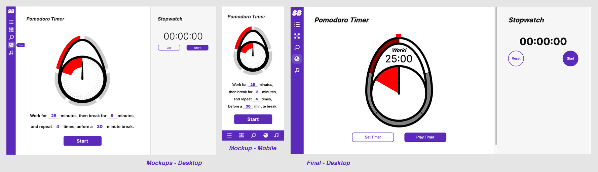

# DECO2017 - Assessment 3
## KDUN2491
The StudBud application that I have created per the Design Brief, has stayed mostly consistent with the design decisions made during the Mockup phase of Assessment 2. Below I will highlight some of the changes that were made. As per my plan for development, the project was compartmentalised by the individual "pages" or features. Each section was worked on through intense iteration before a minimum-viable product was created. Initial setup of the Task and TaskList objects, and the modification of those were the basis for fully developing the rest of the application, in particular the Grid or Block system used to display task items in a Covey Quadrant-like system, where they are displayed on two relative scales of urgency and importance.

### Mockup Comparisons

The biggest changes in the task list were the visual changes in the display of time on the aside, as well as the addition of Edit Task and Delete Task buttons. The Edit Task button leads to a pop-up window with a form that wasn't previously designed in the mockup. During the mockup phase, the plan was for the aside to be directly editable by clicking on the separate elements. From feedback during user-testing, I believe this is still the best option, and the edit task will be moved to the aside instead of the popup in future development.

The Task Block aside holds the same changes as the Task List version. Apart from this the only major changes were the removal of the Urgency and Importance buttons up the top. It was initially intended to allow the user to filter the tasks by these factors, but during development this was found to be cumbersome.

There were no major changes to this page throughout development. The only minor changes were to the layout, to look more balanced on wider screens and be more responsive. Additionally, a Pin/Unpin button was added, as this was missed prior to development.

The visual design of the egg-timer/Pomodoro clock was simplified slightly from the original due to technical reasons. The settings for the reps and break times on the clock were moved to a popup menu. The menu itself changed only slightly to improve consistency with the visual design of other HTML inputs. The buttons on the stopwatch were made round to separate them from the buttons on the Pomodoro, and to be more inline with typical stopwatch applications.

The Music page remained nearly identical, save for the addition of emojis instead of album art. A pulsing border on the music icon in the sidebar was added to indicate that music was playing.

### Feedback and room for improvement
Users were satisfied with the visual appearance of the application, and the general functionality. Unfortunately due to time limitations, not all of the following notes will be addressed for the submission of this assessment. The input that was gathered from test users, however, is invaluable for further development and, in general, self-reflective learning for myself as a developer.

* User wasn't sure how to add, or edit, subtasks.

The comma separated subtask text-input, is not the intended method of input. This is probably more of a by-product of time-management than of ability, and was a an effective way of testing throughout developing the task modification system, and completion system. In the future, this will show a list underneath the text input which is updated every time the text input is changed. It will also allow for the user to drag subtasks to re-order them and to remove them on an individual subtask basis.

* User didn't realise they could scroll up or down.

This was an issue that I hadn't anticipated, and was fairly evident when observing users interacting with the application. Depending on how much information filled the main pages, or the asides, it wasn't always clear that there was more information below——particularly when elements lined up too neatly and weren't half off-screen. This was rectified by showing the scrollbars as default, at the cost of visible bars even when scrolling is not possible, due to the structural layout of the page. Further development will go into addressing the aesthetics of this.

* User didn't realise the timer had finished.

To address the issue of the timer going unnoticed when viewing a separate page, a small, and only reasonably intrusive, pop-up box will be made to slide on screen from below. It needs to have movement to attract attention, as sound is not a helpful signal when the user is in 'study-mode'. This will notify users when the timer has either finished a work/break period or completed a full set of Pomodoro intervals. The use of a popup window may also be useful for maintaining user control over the audio player while 'off-screen'. This will be developed outside of the scope of this assignment.

### Resources and References

##### Code
Dictionary. https://openbase.com/js/google-dictionary-api

Triangle. https://css-tricks.com/snippets/css/css-triangle/

Sort. https://flaviocopes.com/how-to-sort-array-of-objects-by-property-javascript/

Input Suffix. https://stackoverflow.com/questions/49796934/add-a-text-suffix-to-input-type-number

Miscllaneous. https://www.W3schools.com, https://developer.mozilla.org/en-US/docs/Web/JavaScript/Reference

##### Music
HoliznaCC0. (2022). _Blueskies.mp3_ https://freemusicarchive.org/music/holiznacc0/lazy-summer-lofi-1/blue-skiesmp3/

HoliznaCC0. (2022). _Waves.mp3_ https://freemusicarchive.org/music/holiznacc0/lazy-summer-lofi-1/wavesmp3/

HoliznaCC0. (2022). _Laundry on the wire.mp3_ https://freemusicarchive.org/music/holiznacc0/lazy-summer-lofi-1/laundry-on-the-wiremp3/

HoliznaCC0. (2022). _Come Again.mp3_ https://freemusicarchive.org/music/holiznacc0/busted-guitar-lofi-edit/come-again/

M33 Project. (2022). _The Orchestra Improvisation_ https://freemusicarchive.org/music/m33-project/classical-jouneys-vol-1/the-orchestra-improvisation/

M33 Project. (2022). _Classical Kanon_ https://freemusicarchive.org/music/m33-project/classical-jouneys-vol-1/classical-kanon/

M33 Project. (2022). _The Force of the Softness F Dorian Guitar Flute_ https://freemusicarchive.org/music/m33-project/classical-jouneys-vol-1/the-force-of-the-softness-f-dorian-guitar-flute/

M33 Project. (2022). _Beautiful Flute Melody Strings_ https://freemusicarchive.org/music/m33-project/classical-jouneys-vol-1/beautiful-flute-melody-strings/

Crowander. (2020). _Smiling Flowers_ https://freemusicarchive.org/music/crowander/acoustic-miniband-acoustic-minimals/smiling-flowers/

Crowander. (2020). _In the Sun_ https://freemusicarchive.org/music/crowander/acoustic-miniband-acoustic-minimals/in-the-sun/

Crowander. (2020). _Easy Easy_ https://freemusicarchive.org/music/crowander/acoustic-miniband-acoustic-minimals/easy-easy/

Crowander. (2020). _One More Round_ https://freemusicarchive.org/music/crowander/acoustic-miniband-acoustic-minimals/one-more-round/

Les Cartes Postales Sonores. (2018). _Melbourne Rainfall_ https://freemusicarchive.org/music/Les_Cartes_Postales_Sonores/NOISE_ON_EARTH_Vol7__AUSTRALIA/Les_Cartes_Postales_Sonores_-_NOISE_ON_EARTH_Vol7__AUSTRALIA_-_16_Melbourne_rainfall/

Les Cartes Postales Sonores. (2018). _Birds of Bruny Island_ https://freemusicarchive.org/music/Les_Cartes_Postales_Sonores/NOISE_ON_EARTH_Vol7__AUSTRALIA/Les_Cartes_Postales_Sonores_-_NOISE_ON_EARTH_Vol7__AUSTRALIA_-_15_Birds_of_Bruny_island/

Les Cartes Postales Sonores. (2018). _Insectx_ https://freemusicarchive.org/music/Les_Cartes_Postales_Sonores/NOISE_ON_EARTH_Vol7__AUSTRALIA/Les_Cartes_Postales_Sonores_-_NOISE_ON_EARTH_Vol7__AUSTRALIA_-_13_Insectx/

Les Cartes Postales Sonores. (2018). _Dark Water_ https://freemusicarchive.org/music/Les_Cartes_Postales_Sonores/NOISE_ON_EARTH_Vol7__AUSTRALIA/Les_Cartes_Postales_Sonores_-_NOISE_ON_EARTH_Vol7__AUSTRALIA_-_12_Dark_water/
